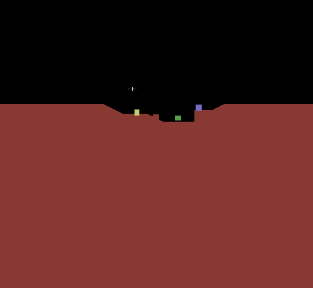
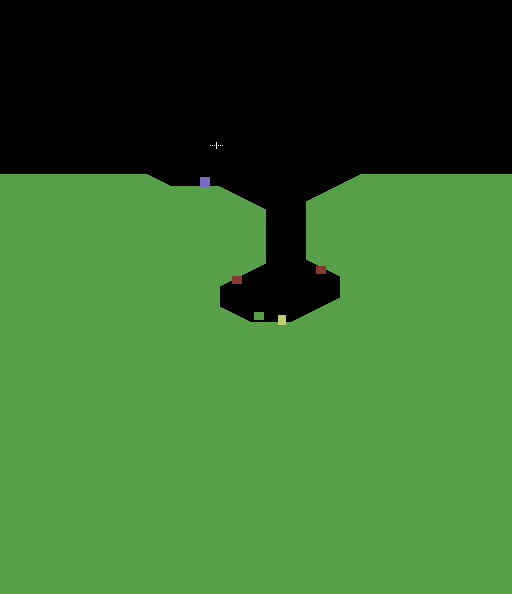
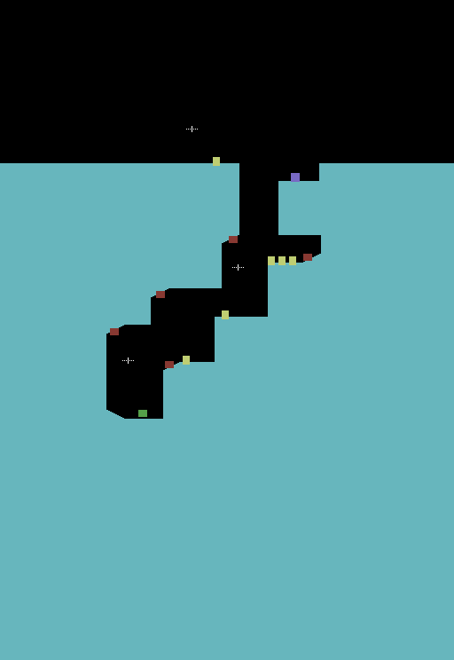
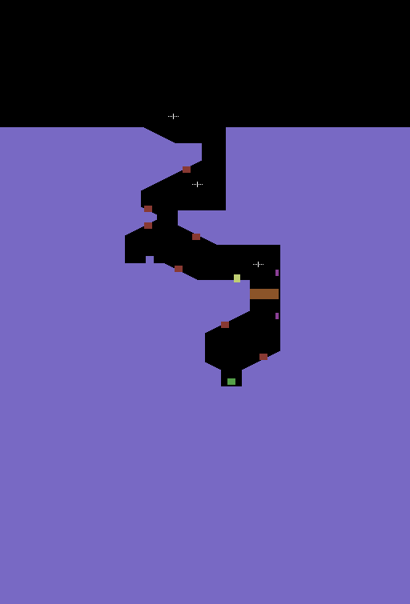
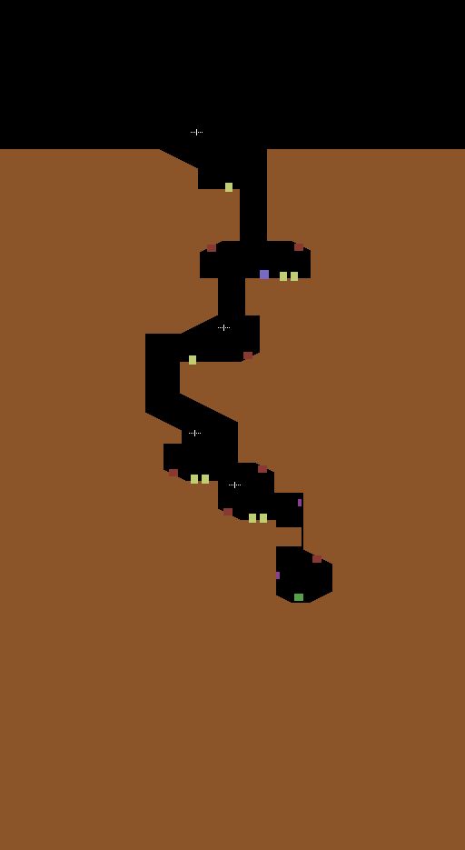
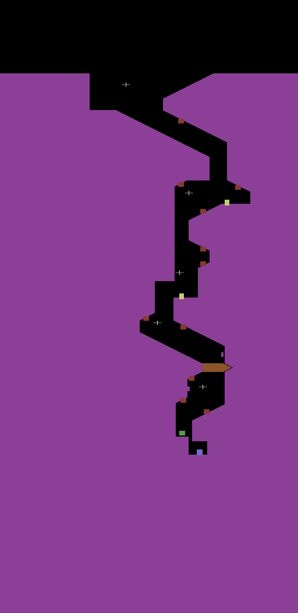

# Thrust (C64) level format

The C64 version uses exactly the same level data format (and the same data)
as the BBC Micro original. All level data lives in two include files:

* `src/levels.asm` — terrain and objects for each level
* `src/level_tables.asm` — restart points, gravity, pointer tables, colours

`tools/levelview.py` renders every level from a built PRG into
`docs/levels/level_N.png` plus a text listing `docs/levels/levels.txt`
(run it after `./build.sh`). Levels are numbered 0-5 here; the game calls
level 0 "mission 1".

| | | |
|---|---|---|
|  level 0 |  level 1 |  level 2 |
|  level 3 |  level 4 |  level 5 |

Map key: rock in the level colour, red = guns, yellow = fuel, green = pod
stand, blue = generator, purple = door switches, orange = door (closed),
white crosses = restart points. Maps start at world row `$100`.

## Coordinates

* **X**: 0-255, wraps around. One unit = 4 screen pixels; the screen shows 80
  units (`window_xpos_INT` is the left edge).
* **Y**: 16 bits, stored as `Y_EXT` (high byte) and `Y` (low byte), growing
  downwards. One unit = 2 screen pixels (the terrain is drawn on every other
  line). The playfield shows about 92 rows.
* The ship starts in space and the planet surface is typically around Y
  `$1A0-$1D0`. Flying up above Y `$120` (`test_player_escaped_to_orbit`)
  leaves the planet.

## Terrain

Each level has four tables (`terrain_data_level_N_A` .. `_D`):

| Table | Meaning |
|-------|---------|
| A | left wall: run lengths (rows) |
| B | left wall: X change per row during that run (signed byte) |
| C | right wall: run lengths |
| D | right wall: X change per row |

A[i]/B[i] means "for A[i] rows, add B[i] to the left wall X on every row".
The walls start at X 0 (left) and X 255 (right), i.e. completely open. Rock is
everything left of the left wall and right of the right wall; where the walls
meet or cross the cave is closed.

The decoder (`terrain_process`, `terrain_accumulate_xpos_fn`) uses two
decoders per wall; the one whose values reach the screen starts at entry 1,
so **entry 0 of each table is effectively unused** (it is always `$FF`/`$00`).
The usual pattern is:

```
A:  $FF,$FF,$AB, $01,$0F, ...   ; entry 0 dummy, 255 rows of sky,
B:  $00,$00,$00, $55,$01, ...   ; then $AB rows down to the surface,
                                ; then a 1-row jump of +$55 (the surface edge)...
```

So a single row with a big step makes a horizontal ledge, longer runs with
small steps make slopes, step 0 makes a vertical wall. The last run should be
`$FF` (the decoder keeps reading past the end of the table otherwise).

Level 0, left wall: `$FF,$FF,$AB,$01,$0F,$01,$0C,$01,$FF` / `$00,$00,$00,$55,$01,$15,$01,$19,$00`

* rows 0-425: X stays 0 (sky)
* row 426: X jumps to $55 (surface edge)
* 15 rows sloping right by 1, a jump of $15, 12 rows of +1, a jump of $19 ...

## Objects

Five parallel tables per level, indexed by object number:

| Table | Meaning |
|-------|---------|
| `level_N_obj_pos_X` | X of the object's left edge |
| `level_N_obj_pos_Y` | Y (low byte) of the object's top |
| `level_N_obj_pos_Y_EXT` | Y (high byte) |
| `level_N_obj_type` | type, list terminated by `$FF` |
| `level_N_gun_param` | guns only, see below |

Object types:

| Type | Object | Width × height (units, `obj_type_width/height`) |
|------|--------|-------|
| 0 | gun pointing up-right | 5 × 8 |
| 1 | gun pointing down-right | 5 × 8 |
| 2 | gun pointing up-left | 5 × 8 |
| 3 | gun pointing down-left | 5 × 8 |
| 4 | fuel | 4 × 10 |
| 5 | pod stand | 5 × 8 |
| 6 | generator (reactor) | 5 × 10 |
| 7 | door switch (right) | 2 × 8 |
| 8 | door switch (left) | 2 × 8 |

Rules:

* **Object 0 must be the pod stand** — the pod/tether code uses object 0's
  position (`object_onscreen`, `nearest_obj_*`). All original levels use
  object 1 for the generator.
* At most 32 objects (`LEVEL_MAX_OBJECTS`).
* Fuel cells should be among the first 12 objects: only 12
  `obj_tractor_counter` entries are cleared at the start of a level.
* Gun parameter: bits 2-4 (`and #$1C`) are the base firing angle (0-28, 0 =
  up, 8 = right, 16 = down, 24 = left); bits 0-1 choose the random spread
  (`gun_param_table`: 1, 3, 7 or 15 angle steps).
* The multiplexer can show 31 sprites at once; fuel and generators use 2.

## Restart points (`level_N_reset_data`)

`level_reset_data_sizes` holds the number of restart points n per level. Each
level's table is 6 rows of n bytes (row-major):

| Row | Meaning |
|-----|---------|
| 0 | ship Y_EXT |
| 1 | ship Y |
| 2 | window X |
| 3 | window Y_EXT |
| 4 | window Y |
| 5 | ship X |

`level_reset` picks the first entry whose ship Y is at or below the depth the
ship had reached, then steps back one entry unless the pod was being carried.
Entry 0 is the start position (all levels: ship at X `$6C`, Y `$191`).
To centre the ship: window Y ≈ ship Y − `$64`, window X ≈ ship X − `$16`.
`level_reset_ptr_table` points at row 0, `level_reset_ptr2_table` at row 1
(= table + n).

## Other per-level tables (`level_tables.asm`)

| Table | Meaning |
|-------|---------|
| `level_gravity_FRAC_table` | gravity (fractional part): 5, 7, 9, 11, 12, 13 |
| `terrain_*_ptrs_LO/HI` | pointers to the four terrain tables |
| `level_obj_*_lookup`, `level_gun_param_lookup` | one word per level, pointers to the object tables |
| `level_colour_terrain` | terrain colour (also text colour) |
| `level_colour_mc1` | colour of "01" bitmap pixels |
| `level_colour_mc3` | colour of "11" pixels and the pod |
| `level_colour_status` | status bar label colour |
| `level_colour_objects` | guns, pod stand, generator |
| `level_colour_shield` | shield and fuel label colour |

## Doors (code, not data)

Levels 3, 4 and 5 have doors opened by shooting a door switch. They are not
part of the level data: `tick_door_logic` checks `level_number` and runs a
hard-coded routine that overwrites rows of the decoded left wall
(`terrain_left_wall`) at a fixed world Y:

| Level | Door top | Shape |
|-------|----------|-------|
| 3 | Y `$0269` | 13 rows, wall X `$AE` minus the opening |
| 4 | Y `$0343` | 21 rows, wall X `$A6`, opens row by row to `$98` |
| 5 | Y `$0370` | diamond, X `$C0`..`$C7`..`$C0` minus the opening |

A new level with a door needs its own routine in `tick_door_logic` (copy one
of the existing ones and change the constants).

## Level sequence

`start_new_level` increments `level_number` and compares it with **6**
(`cmp #$06`). After the 6th level it wraps to 0 and toggles reverse gravity;
whenever reverse gravity switches back off, invisible landscape toggles. So the
rounds go: normal, reverse gravity, invisible, reverse + invisible, normal, ...
Guns fire more often from mission 3 on (`level_hostile_gun_probability`, capped
at `$23`).

## Changing a level

Edit the tables in `src/levels.asm` / `src/level_tables.asm`, then
`./build.sh` (it will report that the PRG differs from the original — that is
expected) and `python3 tools/levelview.py` to check the result. Because the
source is fully symbolic, tables can change length freely.

## Adding levels

To add level 6 (and so on):

1. Add `terrain_data_level_6_A..D` and the five `level_6_*` object tables.
2. Add a 7th entry to each `terrain_*_ptrs_LO/HI` table and each
   `level_*_lookup` word table.
3. Add a restart table `level_6_reset_data`, its size to
   `level_reset_data_sizes` and entries to `level_reset_ptr_table_LO/HI`
   (table) and `level_reset_ptr2_table_LO/HI` (table + n).
4. Add a 7th entry to `level_gravity_FRAC_table` and the six colour tables.
5. Change `cmp #$06` in `start_new_level` to the new number of levels.
6. Doors: extend `tick_door_logic` if needed.

Space: the original level data is about 1.5 KB for six levels. The main
block may grow until `$BFFF` (checked by an `.assert`); there is also free
RAM at `$1000-$1FFF`, `$3003-$3FFF` and `$C000-$CFFF` (see
`memory_map.md`) — level tables can be placed there with their own
`* =` / `.pseudopc` blocks if the main block gets full.
