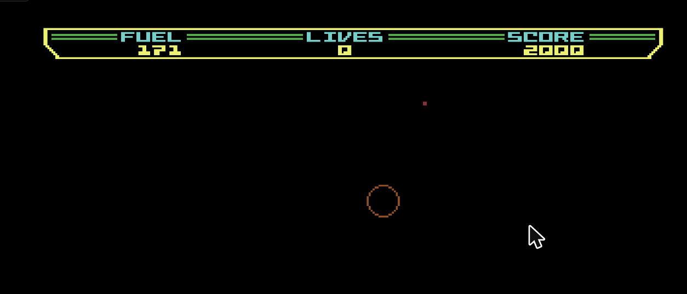

# How Claude beat mission 1 (on the last life)

A log of an AI playing Thrust in the level editor's player: the original
mission 1 (level 0), flown by a small autopilot written on the spot, which
read the C64's memory every frame and pressed the same keys a player does.
It won on the last life.



*Taken a moment after the "MISSION 1 COMPLETE / BONUS 2000" banner: score
2000, fuel 171, no lives left.*

## The rules it played by

* Only Thrust's keys, sent as key events to c64-ready's keyboard handler (the
  same path as the on-screen pad): **A / S** rotate, **Shift** thrust,
  **Space** shield and tractor beam. No memory writes, no cheats.
* It could **read** memory: position, speed, angle and a few flags, from the
  disassembly's labels (`src/thrust.asm`).
* The original game: the editor's template, built through the build API
  (`POST /api/build`) and run in the editor's player.

## Memory it read

| Address | Label | Used as |
|---------|-------|---------|
| `$0D` | `ship_angle` | angle, 0-31: 0 up, 8 right, 16 down (S adds) |
| `$32`, `$33` | `player_xpos_FRAC`, `_INT` | X (one unit = 4 pixels) |
| `$2E`, `$2F`, `$30` | `player_ypos_FRAC`, `_INT`, `_INT_HI` | Y (grows downwards) |
| `$13`, `$14` | `velocity_vectorx_FRAC`, `_INT` | X speed (signed) |
| `$15`, `$16` | `velocity_vectory_FRAC`, `_INT` | Y speed (signed, + is down) |
| `$45` | `pod_line_exists_flag` | the tractor line is drawn |
| `$22` | `pod_attached_flag_1` | the pod is carried |
| `$61` | `level_tick_state` | 0 while playing ($FF starting, 1 paused) |

Mission 1's map, from `docs/levels/levels.txt`: start at X `$6C` Y `$191`,
pod stand at X `$8F` Y `$1BD` (just below and to the right), a gun beside it
at X `$7D`. Flying above Y `$120` leaves the planet.

## The autopilot

Every frame:

1. **Where to go.** A target point for the current phase.
2. **What speed to want.** Proportional to the distance, capped (0.5 units a
   frame; 0.25 with the pod).
3. **What push that needs.** (wanted speed - speed) × 0.2, plus a guess at
   gravity (0.006 a frame), gives the direction to thrust in.
4. **Turn and burn.** That direction becomes a target angle, at most 7 steps
   (about 80°) either side of straight up. Hold A or S until the ship points
   there; thrust only when within one step and the push points the way the
   ship faces.

Phases:

* **go**: fly to 20 rows above the pod stand; when close and slow, **grab**.
* **grab**: come down to 14 rows above the stand and hold Space (the tractor
  beam). When the line appears, **lift**.
* **lift**: climb straight up (target Y `$100`), slowly, still holding Space
  until the pod is attached, then let go.

## What happened

| Game | Ship | What happened | Lesson |
|------|------|---------------|--------|
| 1 | all | The game was started to test the controls (S turned the ship 7 steps in 0.3 s), then the ship just fell while the autopilot was being written. Game over. | Write the code first, start the game second. |
| 2 | first | Two bugs before it flew at all. The first version waited for the "ship destroyed" flag (`$42`) to be 0, but it reads `$FF` while flying normally; the fixed version, reloaded from a new script, referred to a constant (`POD`) left behind in the old one and failed every frame. The ship fell. | Wait on `level_tick_state`; keep the whole autopilot in one script. |
| 2 | next (the counter now read 0 lives: the last ship) | It flew to the pod (wobbling: the target angle flipped between the ±7 limits), hovered 23 rows above it with the beam on, and nothing caught. Brought down to 14 rows. The screen showed the tractor line *was* drawn, yet `pod_attached_flag_1` stayed 0, so it switched to the line flag (`$45`) and climbed, letting go of Space at once. It reached space **without the pod**: no score, and the mission started again (that costs no life). | The line is only the start. Keep holding the beam while pulling away until the pod is attached. |
| 2 | still the last ship | Same approach, holding Space while lifting until `$22` went to `$FF`, at a gentler climb. The pod came up on its line, the ship climbed past `$120` with it, and: **MISSION 1 COMPLETE, BONUS 2000.** | |

Not elegant: it wobbled the whole way (fuel went from 1000 to 171, much of it on
the shield, which the tractor beam shares), never fired a shot, and left the
reactor alone. But it got the pod out.

## The code

Run in the browser console on the editor in development (`npm run dev`, where
the page has `window.editor`), with a game started by holding Space for a
second or two. This is the version that won (the fixes from the table in
place).

```js
const K = { left: ['a', 'KeyA'], right: ['s', 'KeyS'], thrust: ['Shift', 'ShiftLeft'], shield: [' ', 'Space'] };
const held = new Set();
// c64-ready lets go of the C64's Shift on any key down without shiftKey, so
// every key event says whether thrust (Shift) is held
const send = (type, a) =>
  window.dispatchEvent(new KeyboardEvent(type, { key: K[a][0], code: K[a][1], shiftKey: held.has('thrust'), bubbles: true }));
const set = (a, on) => {
  if (on && !held.has(a)) { held.add(a); send('keydown', a); }
  else if (!on && held.has(a)) { held.delete(a); send('keyup', a); }
};
const rd = (a) => window.editor.player.player.ramRead(a);
const s8 = (v) => (v > 127 ? v - 256 : v);
const state = () => ({
  ang: rd(0x0d),
  x: rd(0x33) + rd(0x32) / 256,
  y: rd(0x30) * 256 + rd(0x2f) + rd(0x2e) / 256,
  vx: s8(rd(0x14)) + rd(0x13) / 256,
  vy: s8(rd(0x16)) + rd(0x15) / 256,
  attached: rd(0x22), line: rd(0x45), tick: rd(0x61),
});

const POD = { x: 0x8f, y: 0x1bd };
const c = { kp: 0.03, kv: 0.2, g: 0.006, thrMin: 0.002 };
const clamp = (v, m) => Math.max(-m, Math.min(m, v));
let phase = 'go', running = true;

function loop() {
  if (!running) return;
  requestAnimationFrame(loop);
  const s = state();
  if (s.tick !== 0 || s.y < 16) return [...held].forEach((a) => set(a, false)); // starting, paused, exploding
  let tx = POD.x, ty = POD.y - 20, vmax = 0.5, tractor = false;
  if (phase === 'go' && Math.abs(tx - s.x) < 3 && Math.abs(ty - s.y) < 6 && Math.abs(s.vx) < 0.15 && Math.abs(s.vy) < 0.2)
    phase = 'grab';
  if (phase === 'grab') { ty = POD.y - 14; tractor = true; if (s.line) phase = 'lift'; }
  if (phase === 'lift') { ty = 0x100; vmax = 0.25; tractor = !s.attached; }

  const ex = ((Math.round(tx - s.x) + 128) & 255) - 128; // X wraps at 256
  const ey = ty - s.y;
  const Tx = (clamp(ex * c.kp, vmax) - s.vx) * c.kv;
  const Ty = (clamp(ey * c.kp, vmax) - s.vy) * c.kv - c.g;
  let ta = Math.round((Math.atan2(Tx, -Ty) / (2 * Math.PI)) * 32);
  ta = (Math.max(-7, Math.min(7, ((((ta + 16) % 32) + 32) % 32) - 16)) + 32) % 32;
  const err = ((ta - s.ang + 48) % 32) - 16;
  set('right', err > 0);
  set('left', err < 0);
  const th = (s.ang * 2 * Math.PI) / 32;
  set('thrust', Math.abs(err) <= 1 && Tx * Math.sin(th) - Ty * Math.cos(th) > c.thrMin);
  set('shield', tractor);
}
loop();
// stop: running = false; [...held].forEach((a) => set(a, false));
```

## Things learned about Thrust on the way

* **Picking up the pod** takes three steps: hover close (about 14 rows above
  the stand worked; 23 was too far), hold the beam until the line appears, and
  *keep holding it* while pulling away until the pod lifts. Letting go early
  drops it.
* **Leaving without the pod** fails the mission and replays the level.
* **The title screen ignores keys for a few seconds** after the game loads;
  after that, Space has to be held for a moment to start.
* **Restart points** are picked by depth from the ship's position at the crash
  (`level_reset`), which is why levels played upwards always restart at the
  start: see the user guide, section 7.

## Claude's reasoning during AI play:

### My prompt:
```What I would like to see is you playing a level and beating it. I don't believe you can do that tbh! :D```

- Challenge accepted.

- I'll tackle the challenge by building an autopilot that reads the ship's position, angle, and speed from C64 memory each frame, steering via the normal player keys (rotate, thrust, tractor beam/shield, fire). First I need to locate the relevant memory addresses.

- Now the map. Level 0's layout, from the level listing:

- I've identified the level 1 layout: start near the pod and gun, with the win condition being to grab the pod and fly above Y $120. I'll build the template via the build API to protect your autosaved game, then test the controls before writing the autopilot.

- The build worked. Now some page helpers: the key presses go through the same keyboard events a player makes, plus a state reader:

- The ship will likely crash while I build out the autopilot, but we have lives to spare—it'll fly to a point above the pod, hold the tractor beam until it latches, then climb straight out.

- The "destroyed" flag reads $FF while flying normally, so I'll gate on the level state alone. Checking the screen first:

- The ship lost all three lives while I was coding, so it's back at the title screen with mission 1 at the bottom. I'll fix the gate, then start a new game and launch the autopilot together.

- The log is empty, so the level is still starting up (state $FF). Also, my reloaded loop refers to POD, which only existed in the earlier script. Fixing that and checking again:

- The autopilot flew over to the pod and is hovering above it with the tractor beam on, which is promising. It wobbles a lot, though. Looking at the screen:

- It's hovering above the pod on its last life, but the beam hasn't latched on. It's probably out of range: the ship is about 23 rows above the pod. I'll bring it in closer while it keeps flying:

- It's now 15 rows above the pod and still not latching on. Checking whether the beam is actually showing:

- The tractor line is already drawn between ship and pod, so it's caught. My "attached" flag was the wrong one. The line flag (pod_line_exists_flag, $45) shows it. Switching to that and climbing out:

- It's climbing with the pod at Y $13F. It's out of the atmosphere at $120.

- The pod got dropped because autopilot released the beam too early during ascent instead of holding it like in Thrust. I'll fix that logic and retry on this final life.

- The pod is attached this time (flag $22 = $FF) and the ship is climbing with it. Watching:

- MISSION 1 COMPLETE, BONUS 2000. Saving that screen and stopping the autopilot:

- I beat it: the screen showed "MISSION 1 COMPLETE, BONUS 2000". It wasn't pretty, though.

- I didn't fly it with my own reflexes. I wrote a small autopilot that ran inside the page. Every frame it read the ship's position, speed and angle from the emulator's memory, and it steered only with the keys you'd use: A/S, Shift, and Space for the tractor beam. It played the original mission 1:
1. Fly over to the pod.
2. Hover about 14 rows above it with the beam on.
3. Keep holding the beam while climbing until the pod latches on.
4. Climb straight up out of the atmosphere.

### The honest score:
- Game 1: all three lives lost while I was still writing the code. The ship just fell.
- Game 2, first life: used up while I worked out the controls and tuned the autopilot.
- Game 2, second life: reached space, but without the pod. The autopilot let go of the beam as soon as the line appeared, so no score.
- Game 2, last life: pod on, out into space, mission complete. Fuel went from 1000 to about 220, mostly on the shield and on wobbling about.

- So it took most of two games' worth of lives, and the final run was on the last one. It never fired a shot or touched the reactor.

- The saved shot was taken a moment after the banner, with the 2000 bonus in the score: /tmp/claude-chrome-screenshots-CwsobM/screenshot-1791319742307-0.png

✻ Worked for 4m 55s · done 21:49 · 1 shell still running

Prompt:  
```AMAZING! I'd like you to log your process and steps taken to achieve success, and get that last life clutch win! Loved watching it tbh!```