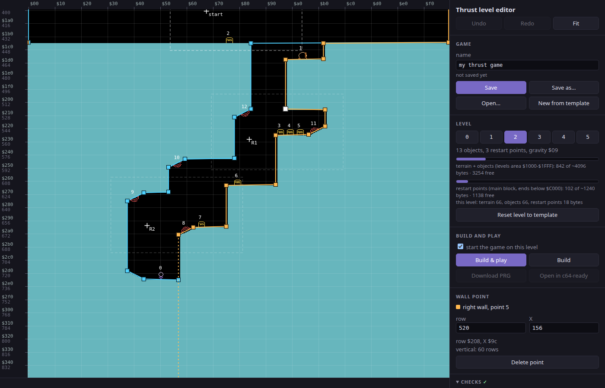
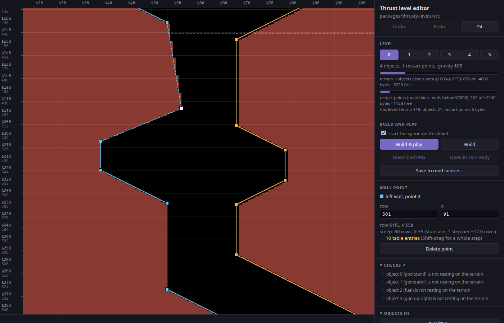
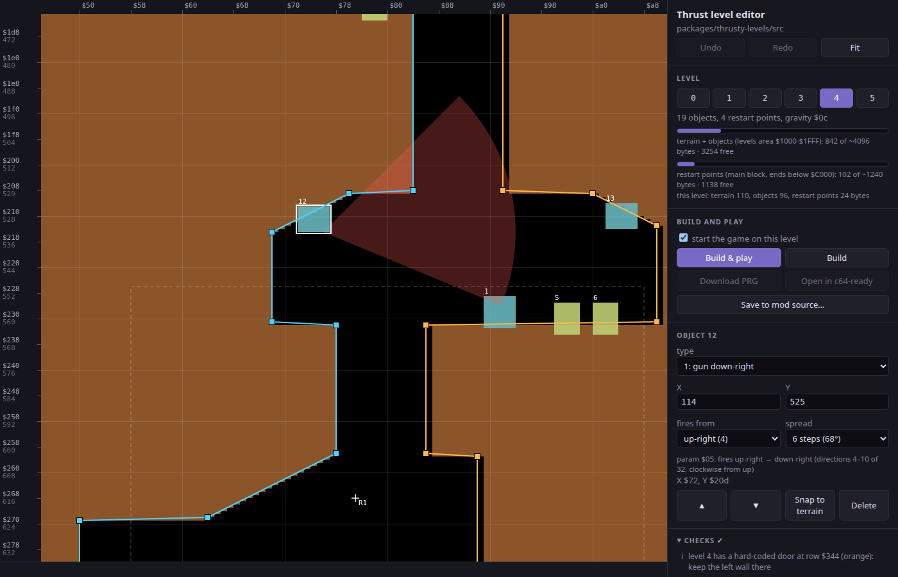
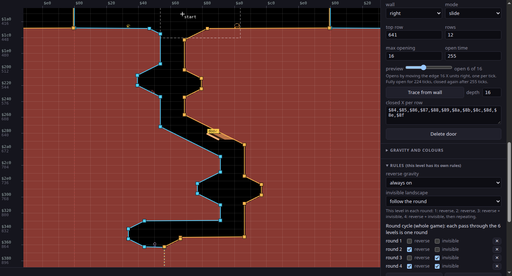
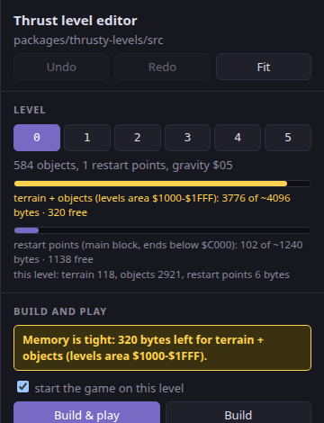
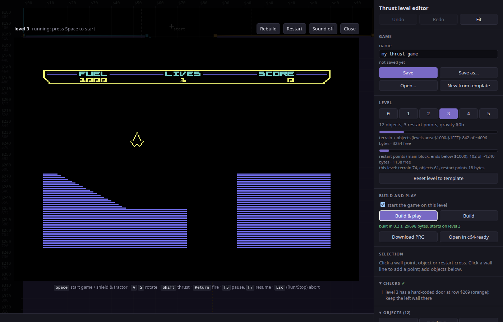

# Thrust level editor: user guide

The level editor lets you redesign the six levels of **Thrust** (Commodore 64,
Firebird 1986) in your browser: drag the cave walls into shape, place guns,
fuel and the pod, set where the ship restarts, pick gravity and colours, and
press one button to play your level in a C64 emulator.

It is built on the **thrusty-levels** mod (`packages/thrusty-levels`). Every
new game starts as a copy of the **template**: the original game's six levels.
Each game you make is saved as **one JSON file**, wherever you like, so you can
keep as many games as you want and never have to touch the mod's source files.
Building turns a game into a normal C64 program (`.prg`).



## Contents

1. [Getting started](#1-getting-started)
2. [The screen](#2-the-screen)
3. [Moving around](#3-moving-around)
4. [How Thrust levels work](#4-how-thrust-levels-work)
5. [Editing the cave walls](#5-editing-the-cave-walls)
6. [Objects: guns, fuel, pod, reactor](#6-objects-guns-fuel-pod-reactor)
7. [Restart points](#7-restart-points)
8. [Gravity and colours](#8-gravity-and-colours)
9. [Doors and rules](#9-doors-and-rules)
10. [Checks](#10-checks)
11. [Memory](#11-memory)
12. [Building and playing](#12-building-and-playing)
13. [Saving your work](#13-saving-your-work)
14. [Keyboard and mouse reference](#14-keyboard-and-mouse-reference)
15. [Troubleshooting](#15-troubleshooting)

---

## 1. Getting started

You need:

* **Node.js 24** or newer
* **Java** and **KickAssembler 5** at `/opt/KickAss.jar` (or set the
  `KICKASS` environment variable to its path). Only needed for building and
  playing; you can edit without it.

Start the editor:

```
cd packages/level-editor
npm install          # first time only
npm run dev
```

Open the address it prints (normally <http://localhost:5173>). The editor
starts a new game from the template straight away: the original six levels,
ready to change. To carry on with a game you saved, click **Open…** (see
[Saving your work](#13-saving-your-work)).

Prefer a fixed address? `npm run serve` builds the editor and serves it at
<http://127.0.0.1:5180>.

> The editor server only reads the mod (it never changes it) and runs
> KickAssembler for builds. It listens on your own computer only.

## 2. The screen

**The map (left).** The current level, drawn the way the game draws it:
rock in the level's colour, the cave in black. On top of it:

| You see | It is |
|---------|-------|
| blue line and squares | the **left wall** and its points |
| orange line and squares | the **right wall** and its points |
| grey dot at the top | the fixed start of a wall (cannot be moved) |
| dashed line below the last point | the wall carries on straight down from there (see [the last points](#5-editing-the-cave-walls)) |
| dashed wall segment | an uneven slope (costs extra memory, see [5](#5-editing-the-cave-walls)) |
| game sprites with numbers | objects: red guns, yellow fuel, violet pod stand with its pod, orange reactor, pink door switches |
| white crosses `start`, `R1`, `R2`... | restart points |
| dashed boxes | roughly what the screen shows when the ship restarts there |
| red dashed vertical line | the edge of the world: X wraps around from `$FF` to `$00` |
| orange stripes with a "door" tab | the level's door: solid = at the preview opening, faint = closed |

Rulers show the position: **X** across the top (0-255, in hex), the **row**
down the left (hex above, decimal below). The bar at the bottom shows the
position under the mouse.

**The panel (right).** From top to bottom:

* **Game**: the game's name and file, Save, Open, New from template.
* **Level**: pick level 0-5 ("mission 1-6"), memory meters, reset a level.
* **Build and play**: build the game and play it.
* **Selection**: details of whatever you clicked (wall point, object or
  restart point), with fields you can type into.
* **Checks**: problems with the level. Click one to jump to the object.
* **Objects**: add objects, the list of objects.
* **Restart points**: the list, add a restart point.
* **Gravity and colours**, **Terrain tables** (the raw numbers): click the
  heading to open them.
* **Assembler files**, **View**, **Controls**.

**This guide** is built into the editor: click **Guide** at the top of the
panel or press `?`. Esc closes it.

## 3. Moving around

| Do | To |
|----|----|
| drag empty space | pan |
| mouse wheel | scroll up and down (Shift + wheel: sideways) |
| Ctrl + wheel, or `+` / `-` | zoom |
| `F` or the **Fit** button | fit the whole cave in view |
| `1` - `6` | switch to level 0 - 5 |

## 4. How Thrust levels work

A few facts make the editor much easier to understand.

**Two walls.** Every level is a cave between a **left wall** and a **right
wall**. Everything left of the left wall and right of the right wall is rock.
Above the planet both walls sit at the far edges, so the sky is open.

**Rows and X.** The world is 256 units wide (X `$00`-`$FF`) and wraps around:
fly off the right edge and you come back on the left. One X unit is 4 pixels
on the C64 screen. Going down, the world is measured in **rows** of 2 pixels.
Levels start around row 400 (`$190`); the surface is usually around row
420-470 and caves go down to row 800-1300. The map is drawn in the game's
proportions, so it looks like the real thing.

**Walls are made of straight pieces.** The game stores a wall as "for N rows,
move X by S each row". In the editor you simply place points and the wall runs
in straight lines between them:

* **Vertical**: a segment where X does not change.
* **The classic Thrust slope**: 1 X unit per row (about 27°).
* **Shallow slopes**: 2, 3... units per row.
* **Ledges**: a jump in one row (two points on neighbouring rows).
* **Steeper than the classic slope**: the game has no such slope; it is
  made of little steps. The editor builds the steps for you, but each step
  costs memory (see below).

**The cave must close.** Below the last point a wall goes straight down
forever. Make the walls meet at the bottom, or the cave stays open (Checks
warns about this).

## 5. Editing the cave walls



| Do | To |
|----|----|
| drag a point | move it |
| Shift + drag | move it, keeping the segment above it a clean slope (a whole number of X per row) |
| click on a wall line | add a point there (you can keep dragging) |
| click below the last point, on the dashed line | add a new last point |
| right-click a point, or select it and press Delete | remove it |
| arrow keys | nudge the selected point by 1 (Shift: by 8) |
| type in **row** / **X** in the panel | place it exactly |

Points cannot pass each other: a point always stays below the one before it
and above the one after it. The grey point at the top of each wall is fixed.

**Watch for dashed segments.** A segment whose X change does not divide evenly
by its number of rows (say 60 rows and 5 units across) is drawn **dashed**. The
game can only do it as a staircase, and every step is two more entries in the
level's tables. The panel tells you the cost, e.g. "steep: 60 rows, X +5 ...
→ 10 table entries". To avoid it, hold **Shift** while dragging, or move the
point so the segment becomes vertical or an even slope. The original levels use
almost only vertical walls, 1-per-row slopes and ledges.

**The last points: close the cave.** A wall's data ends at its last point;
below it the game keeps the wall at the same X forever, which the editor draws
as a dashed line going down. So the bottom of the cave is wherever the two
walls meet: end both walls at the same X (or let the left wall cross to the
right of the right wall), and everything below is solid rock. All six original
levels end both walls at the same X, so their two dashed lines lie on top of
each other at the bottom of the cave. If they end
apart, the cave is an endless open shaft downwards, and Checks warns "the cave
is open at the bottom". To make the cave deeper, click on a dashed line to add
a point there and drag it down.

**Doors.** Levels 3, 4 and 5 start with a door that opens when you shoot a
door switch (shown in orange). A door's shape is set per row, separately from
the wall, so if you move the wall around a door, retrace the door (see
[Doors and rules](#9-doors-and-rules)).

## 6. Objects: guns, fuel, pod, reactor



| Object | What it does |
|--------|--------------|
| gun up-right, gun up-left | sits on a floor, fires upwards |
| gun down-right, gun down-left | hangs from a ceiling, fires downwards |
| fuel | collect with the tractor beam |
| pod stand | where the pod sits; carry it out of the planet to finish the level |
| generator | the reactor: shooting it silences the guns for a while; hit it too often and the planet starts a countdown to explode |
| door switch R / L | opens the level's door; sits against a wall |

Objects are drawn with the game's own sprites, at the place the game draws
them, so what rests on the floor in the editor rests on it in the game. Each
kind has its own colour (the swatches in the panel match). Tick **objects in
the level's game colours** under **View** to see them in this level's real
colours instead: in the game, guns, the pod stand and the reactor dome share
one colour.

**Add** an object with the buttons in the **Objects** section: it appears in
the middle of the map, already resting on the nearest floor. **Drag** it where
you want it.

**Snapping.** Objects snap onto the terrain the way they sit in the original
game: fuel, pod stand, reactor and upward guns rest on the floor below them,
downward guns hang from the ceiling above, door switches stick to the wall
beside them. Hold **Alt** while dragging to place freely, or turn snapping off
under **View**. Up/down arrow keys nudge objects without snapping.

While snapping is on, objects that rest on the terrain **follow it when you
edit a wall**: lower a floor and the fuel on it goes down with it. Objects you
placed freely (not resting) stay where they are.

**Snap to terrain** in the panel puts the selected object back on the ground;
**Snap all to terrain** (Objects section) does it for every object of the
level. Use it after loading a level whose terrain was changed by hand, or when
Checks says objects are "not resting on the terrain".

**Guns.** Select a gun to see its firing arc (red). Set:

* **fires from**: the direction the arc starts at (up, up-right, right, ...).
* **spread**: how wide the arc is. The gun fires at random directions
  clockwise from the start direction across the spread.

Tick **firing arcs of all guns** under **View** to see every gun's arc at
once.

**Order matters.** The game has a few rules about the object list, and the
editor follows them for you when you add objects:

* **Object 0 must be the pod stand.**
* **Fuel must be among the first 12 objects** (later fuel cells do not work).
* **At most 32 objects** per level.

Use ▲ / ▼ to move the selected object in the list, or **Sort objects** (pod
stand, reactor, fuel, then the rest).

## 7. Restart points

Restart points are where the ship comes back after losing a life: the last
restart point above the deepest place it reached (if it was carrying the pod,
the next one down instead). `start` (restart point 0) is where the level
begins.

* **Drag** a cross to move it. The dashed box (roughly the screen at that
  moment) moves with it.
* **Add restart point** puts a new one in the middle of the map. Restart points
  are kept in order from top to bottom.
* Select one to type exact values. **Centre window on ship** puts the screen
  box back around the ship.
* The start position cannot be deleted.

Keep restart points in open space (not in rock) and in order from top to
bottom; Checks warns otherwise.

## 8. Gravity and colours

Open **Gravity and colours** in the panel.

* **Gravity**: bigger is stronger. The original levels use 5, 7, 9, 11, 12
  and 13 for levels 0-5.
* **Colours**: six colours from the C64 palette: the rock (and text), two
  bitmap colours, the status bar labels, the guns / pod stand / reactor, and
  the shield. The map redraws in the new colours.

## 9. Doors and rules



### Doors

Each level can have one door, on the left or the right wall. Shooting any door
switch (object 7 or 8) on the level opens it; after a while it closes again.
The **Door** section of the panel shows the current level's door:

* **Add door, left wall / right wall**: a 12-row door at the middle of the
  view, sticking out of the wall by **depth** X units.
* **wall**: which wall the door is part of.
* **mode**:
  * **slide**: the whole door edge moves back into the wall by up to **max
    opening** X units, one per tick (levels 3 and 5 of the original).
  * **reveal**: the rows open one at a time from the top, to **open X**, up to
    **rows that open** rows (level 4 of the original).
* **top row**, **rows**: where the door starts and how tall it is.
* **open time**: how long the switch keeps the door open, in ticks (255 in the
  original game). The text below says how long it stays fully open.
* **preview**: drag to see the door part open in the map. It only changes the
  view, not the game.
* **Trace from wall**: makes every row stick out of the wall by **depth** X
  units again, for example after you moved the wall.
* **Fill passage**: makes every row reach the opposite wall, so the closed
  door blocks the passage completely. A slide door's **max opening** is set so
  it opens all the way back to its own wall.
* **closed X per row**: the door's edge, one value per row (hex with `$`, or
  decimal). Use this for shapes like the diamond on level 5.

**How to read the map.** In the game, each door row replaces the wall at that
row. The map draws the door the way the game will show it at the **preview**
opening:

* **solid orange**: door rock sticking out into the cave;
* **faint orange**: where the closed door is;
* **black with orange hatching**: rock the door cuts away. A slide door opens
  every row by the same amount, so where the wall slopes, some rows go back
  past the terrain and leave a notch in the rock. Make the closed edge follow
  the wall's shape, or lower the max opening, to avoid it.

To make a door wider, use **Fill passage**, **Trace from wall** with a bigger
depth, or Shift-drag a row dot. Then check the **max opening**: a slide door
only opens by that much.

In the map, drag the door's **tab** to move the door (Shift: sideways only).
When the door is selected, or when you zoom in, each row has a dot on its
edge: drag a dot to move that row (Shift: all rows). Arrows nudge the
selection; Delete removes the selected row, or the door if the tab is
selected.

Checks warns when a door has no switch, when it still blocks the passage when
fully open, or when a slide door would open past the edge of the world.

### Rules

A **round** is one pass through all six levels. In the original game the
second round has reverse gravity, the third has invisible landscape, the
fourth has both, and then it starts again. The **Rules** section lets you
change this:

* **Round cycle** (the whole game): one line per round, with **reverse** and
  **invisible** ticked as needed. **Add round** adds one (up to 8), ✕ removes
  one, and **Original cycle** puts back the original four.
* **reverse gravity** / **invisible landscape** (this level only): **follow
  the round**, **always on**, **always off**, or **opposite of the round**.
  For example, set reverse gravity to always on for a level that is meant to
  be flown upside down.

The line under the two choices shows what the level will be like in each
round. The game shows its "reverse gravity" and "invisible landscape" messages
the first time each one comes on.

## 10. Checks

The **Checks** section lists problems in the current level:

* **✖ errors**: the level will not work (e.g. object 0 is not the pod stand,
  too many objects, out of memory). Fix these.
* **! warnings**: probably a mistake (no reactor, restart point inside rock,
  cave open at the bottom, memory getting tight).
* **i notes**: worth knowing (an object floating above the ground, door
  switches on a level without a door).

Click a message about an object or restart point to select it. A ✓ next to
the heading means no errors or warnings.

## 11. Memory

The C64 has little room for level data, and the meters under **Level** show how
much is used:

* **terrain + objects** (in the mod's levels area, `$1000-$1FFF`): 4096 bytes.
* **restart points** (in the main program): about 1240 bytes.

The numbers are close estimates; the build makes the final check.



When an area gets **tight** (less than 10% free) its meter turns amber and a
banner appears above Build & play. When it is **over**, everything turns red,
Checks shows an error, and the build will fail until you remove something.

What costs memory:

| Thing | Bytes |
|-------|-------|
| each wall piece (table entry) | 2 |
| each step of an uneven (dashed) slope | 4 (two entries) |
| each object | 5 |
| each restart point | 6 |

The six original levels together use about 900 bytes, so there is plenty of
room. The quickest savings are dashed slopes: make them even with Shift-drag.

## 12. Building and playing



**Build & play** (or **Ctrl + Enter**) builds the game with your changes and
starts it in the built-in C64 emulator. It takes about a second. The build
uses a temporary copy of the mod; nothing is written to the mod's files.

With **start the game on this level** ticked (the default), the game starts on
the level you are editing, so you do not have to play through the others.
Untick it to play from level 0 as normal.

Game keys:

| Key | Action |
|-----|--------|
| Space | start the game; shield and tractor beam |
| A / S | rotate left / right |
| Shift | thrust |
| Return | fire |
| F5 / F7 | pause / resume |
| Esc | abort the game (Run/Stop) |

While the game is shown, the editor's own keys are switched off. The buttons
above the game:

* **Rebuild**: build your latest edits and restart. Edit, rebuild, try again.
* **Restart**: run the same build again.
* **Sound off / on**.
* **Close**: back to the editor.

**Build** only builds, without playing, e.g. to check for errors. If the build
fails, the panel lists the errors with the table they are in, and the full
KickAssembler log.

After a build you can also **Download PRG** (to run in VICE or on a real C64)
or **Open in c64-ready** (the c64-ready emulator site; its address can be
changed under **View**).

## 13. Saving your work

**A game is a file.** Each game you make is one `.json` file holding all six
levels. Keep them wherever you like, copy them, share them, put them in
version control: the editor does not mind. The mod's own source files are the
template and never change.

The **Game** section at the top of the panel:

| | |
|--|--|
| **name** | the game's name, up to 28 characters. Saving names the file after it ("Big Caves" → `big-caves.json`), and the game shows it centred on the title screen, under the high score table. |
| **author** | who made the game, up to 25 characters. The title screen shows it centred under the name as "BY …"; leave it empty for no author line. |

The title screen font has only A-Z (always upper case), 0-9, space and full
stop, so the name and author boxes take only those: letters turn upper case as
you type, `-` and `_` become spaces, and other characters are not accepted.
The line under the fields shows both lines as the game will show them.
| file line | the file the game was opened from or saved to (or "not saved yet"), and **unsaved changes** when you have edited it since. The browser tab shows a • too. |
| **Save** (Ctrl+S) | save the game. |
| **Save as…** (Ctrl+Shift+S) | save it as a new file, e.g. to try something out without changing the original. |
| **Open…** (Ctrl+O) | open a saved game. You can also drop a `.json` file on the page. |
| **New from template** | start a new game from the original six levels. |

Opening a game or starting a new one asks first if you have unsaved changes.

**Where files go.** In Chrome and Edge, Save asks where to save the first time
and then saves to the same file each time. In other browsers (Firefox,
Safari) Save downloads the file to your downloads folder; save again and you
get a new download (the browser may call it `big-caves (1).json`). Keep the
newest one.

**Autosave.** Every change is also kept in your browser as you work. Close the
tab and come back: the game you were editing is still there, unsaved changes
included. This is a safety net only: it lives in this browser alone, and it is
replaced when you open or start another game. **Save** to keep a game.

**Undo / Redo** (Ctrl+Z / Ctrl+Shift+Z) work across all edits. **Reset level
to template** (Level section) puts the current level back to the template's
version; Undo brings yours back.

**Assembler files** (click the heading to open it). For building the mod by
hand or sharing levels as source code:

| Button | Does |
|--------|------|
| Copy terrain .byte lines | copy the current level's wall tables, ready to paste into `levels.asm` |
| levels.asm / level_tables.asm | download the game as the mod's two level files |
| Import .asm files | start a new game from a `levels.asm` and/or `level_tables.asm` (or drop them on the page) |

To make the game part of the mod itself, put the two downloaded files into
`packages/thrusty-levels/src` and run `./packages/thrusty-levels/build.sh`.

## 14. Keyboard and mouse reference

| Input | Action |
|-------|--------|
| drag point / object / restart cross | move it |
| drag door tab / door row dot | move the door / one row (Shift: sideways only / all rows) |
| Shift + drag point | keep an even slope |
| Alt + drag object | do not snap to the terrain |
| click a wall line | add a point |
| right-click, Delete, Backspace | delete the thing under the mouse / the selection |
| arrows (Shift: ×8) | nudge the selection |
| Esc | deselect |
| drag empty space, wheel | pan |
| Ctrl + wheel, `+`, `-` | zoom |
| `F` | fit the level |
| `1` - `6` | level 0 - 5 |
| Ctrl + Z, Ctrl + Shift + Z (or Ctrl + Y) | undo, redo |
| Ctrl + Enter | build and play |
| Ctrl + S, Ctrl + Shift + S | save, save as |
| Ctrl + O | open a game |
| `?` | open this guide (Esc closes it) |

## 15. Troubleshooting

**"no build API here" / "the editor server is not running".** Building,
playing and New from template need the editor's server: start the editor with
`npm run dev` or `npm run serve` (not by opening the HTML file). Saving and
opening games work without it.

**"Restart the editor server".** The server is older than the page. Stop
`npm run dev` and start it again.

**"not a Thrust level editor game file".** The file is not a saved game (for
example a different JSON file). Games saved by older versions of the editor
("Save JSON") open fine.

**Save keeps asking where to save.** After a reload the browser no longer
knows which file the game came from. Pick the same file again (Chrome and
Edge), or use the newest download (other browsers).

**The build fails.** Read the error list under Build and play. Out of memory:
see [Memory](#11-memory). Anything else is usually a hand edit in the `.asm`
files; the KickAssembler log has the details.

**The memory meter shows one bar labelled "main block".** The editor does not
know the mod's levels area. Restart the editor server, then reload the page.

**Keys do nothing in the game.** Click anywhere on the page so the browser tab
has the keyboard. Thrust uses the keyboard only (no joystick); see the key
table in [Building and playing](#12-building-and-playing).

**An object floats above the ground (or sinks into it) in the game.** The
terrain under it was changed while snapping was off, or by hand in the `.asm`
file. Click **Snap all to terrain** in the Objects section (or select the
object and click **Snap to terrain**). Checks lists objects that are not
resting on the terrain.
